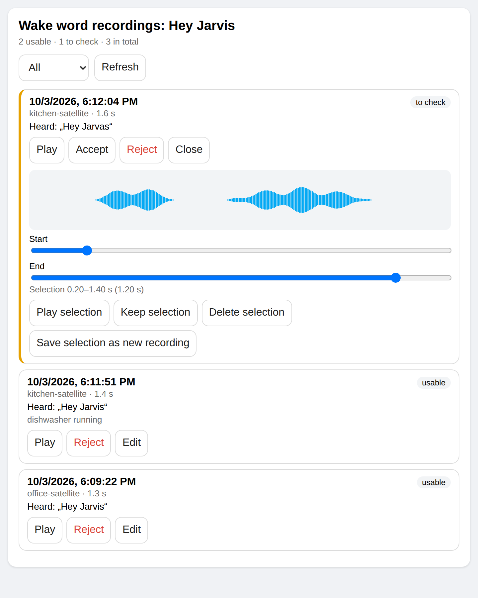

# Wake Word Collector

Record examples of **your own wake word** with **your own voice satellites**,
in your rooms, with your voices, for training a custom wake word model
(microWakeWord, openWakeWord).

[Deutsch weiter unten](#deutsch)



## How it works

1. You say *"record the wake word"* to a satellite.
2. That satellite switches to collection mode. Its voice assistant keeps
   listening; every utterance is recorded from the satellite's own microphone
   (including the moment before listening started) and uploaded to Home
   Assistant together with the speech-to-text result.
3. You say only the wake word, as often as you like, also several times in one
   breath: *"Hey Jarvis, Hey Jarvis"* becomes two separate clips, split at the
   quietest point. The wake word is never split into single words.
4. Home Assistant sorts every clip:

   | Category | When |
   | --- | --- |
   | **usable** (`candidates`) | the transcript is only the wake word or an accepted variant |
   | **to check** (`needs_review`) | anything else: an unusual pronunciation is kept, not lost |
   | command (`control`) | contains a command word such as "done" |
   | rejected (`rejected_quality`) | too quiet, clipped or with DC offset, or rejected by you; kept for recovery |
   | not the wake word (`negatives`) | marked by you: the model learns to ignore it |
   | activation (`triggers`) | optional: what a satellite heard right before it woke up, to judge |

5. *"I am done"* ends collection mode. *"The last one was bad, a car drove by"*
   rejects the last clip (or just notes the noise).
6. On the **review card** you listen, accept or reject, and trim clips in a
   waveform editor (keep, delete or extract a selection as a new clip).
   Originals are backed up before every edit.
7. [Wake Word Trainer](https://github.com/ChristophBellmann/wake-word-trainer)
   fetches the usable clips through a token-protected export, trains a
   microWakeWord model, measures it on your held-out recordings and exports
   it for `micro_wake_word` on the satellites.

## Requirements

- Home Assistant 2025.4 or newer; a voice pipeline with speech-to-text.
- ESPHome voice satellites with `voice_assistant`, `micro_wake_word`, a media
  player and `http_request` (the usual voice satellites based on ESP32-S3 with
  PSRAM). The microphone must deliver 16 or 48 kHz.

## Installation

HACS → ⋮ → *Custom repositories* →
`https://github.com/ChristophBellmann/ha-wake-word-collector`, category
*Integration*. Install *Wake Word Collector*, restart Home Assistant.

## Setup

### 1. Home Assistant

*Settings → Devices & services → Add integration → Wake Word Collector*:

- **Wake word** as your speech-to-text writes it, e.g. `Hey Jarvis`.
- **Also counts as the wake word**: transcriptions that are fine too, comma
  separated, e.g. `hey jarvas, hi jarvis`. A trailing "n"/"s" on longer words
  ("Jarvisn") is accepted anyway.
- **Command words**: recordings containing them are kept apart.
- **Storage folder**: default `<config>/wake_word_collector/<wake word>`.

The next step shows the **upload URL**, a **token** and the **command sensor**
for the satellites. They are shown again under *Configure*.

For a GUI microphone test without Assist or the training computer, call
`wake_word_collector.record` with the satellite's `device` identifier. Call once to start, again to stop and save; `wake_word_collector.stop` also saves.
Recording continues until stopped. Long sessions are split into segments of
`wake_word_manual_duration` (default 30 seconds, configurable up to 120 seconds),
preserving the beginning of each segment.
The clip has no transcript until optional workstation recognition runs: listen
under **To check** and accept extracted examples manually.
Quality warnings remain visible and clips wait for manual acceptance. This requires the matching ESPHome package.
The review card updates when recordings change; optional `recordings_entity` selects
the statistics sensor and `device_names` maps device identifiers to room names.

### 2. Satellites (ESPHome)

Add to every satellite's configuration, with your IDs:

```yaml
packages:
  wake_word_collection:
    url: https://github.com/ChristophBellmann/ha-wake-word-collector
    ref: main
    files:
      - path: esphome/wake-word-collection.yaml
        vars:
          wake_word_device: kitchen-satellite     # lower case, - and _
          wake_word_url: http://homeassistant.local:8123/api/wake_word_collector/clips/hey_jarvis
          wake_word_token: !secret wake_word_token
          wake_word_command_entity: sensor.hey_jarvis_satellite_command
          wake_word_microphone_id: i2s_mics       # your microphone
          wake_word_va_id: va                     # your voice_assistant
          wake_word_media_player_id: external_media_player
```

The package adds the recorder component, *Start/Stop wake word collection*
buttons and a *Wake word collection* status. The satellite needs no
permission to perform Home Assistant actions: it only reads the command
sensor and uploads over HTTP. If your Home Assistant only speaks HTTPS with a
private CA, add the CA to the satellite or use the local HTTP URL. To pin a
version, set `ref:` above and `wake_word_components:
github://ChristophBellmann/ha-wake-word-collector@<version>`.

### 3. Voice commands

- **LLM conversation agents** (with *Assist* control): nothing to do. The
  integration registers intents the agent can call: start, stop, statistics,
  a review of the last clip, and changing how recordings are announced.
  That wish ("announce it like a pirate") is kept in
  `text.<wake word>_announcement` and handed to the agent with every start.
- **Built-in conversation agent**: import the blueprint
  [voice_commands.yaml](blueprints/automation/wake_word_collector/voice_commands.yaml)
  (*Settings → Automations → Blueprints → Import*) and enter your wake word
  and sentences in your language. It also answers the wake word itself with
  silence while collecting, so the examples do not reach the agent.

### 4. Review card

The card is loaded automatically; add `type: custom:wake-word-collector-card`
to a dashboard. Texts follow your Home Assistant language (English, German).

### 5. False alarms (optional)

With `wake_word_report_triggers: "true"` in the package vars, every satellite
also reports its wake word activations outside collection mode: the last
seconds before the detection, uploaded after the voice assistant finished.
In the card (view *Activations*) mark each one as *Was the wake word* (more
real examples) or *False alarm*; or simply say *"I did not call you"* /
*"Fehlalarm"* right after a wrong activation (intent for LLM agents, sentences
in the blueprint). False alarms, clips marked *Not the wake word*, and command
recordings without the wake word are exported as negatives: the next
training learns to ignore exactly what woke your satellites up.

## Training from Home Assistant

With [Wake Word Trainer](https://github.com/ChristophBellmann/wake-word-trainer)
running as a service on the training computer (`wake-word-trainer serve`),
enter its address and token under *Configure*. You get:

| Entity | |
| --- | --- |
| `sensor.<wake word>_training` | idle, running, completed, failed …; round, step, best recall and false activations per hour as attributes |
| `sensor.<wake word>_training_progress` | percent |
| `select.<wake word>_training_profile`, `button.<wake word>_start_training`, `button.<wake word>_stop_training` | start and stop with a profile of the service |
| `binary_sensor.<wake word>_trainer` | the training computer is reachable |
| `sensor.<wake word>_model` | the last finished model, taken over automatically |

The finished model is served by Home Assistant for the satellites:

```yaml
micro_wake_word:
  models:
    - model: http://homeassistant.local:8123/api/wake_word_collector/model/hey_jarvis/hey_jarvis.json
```

ESPHome downloads it when compiling: flash the satellites after a new model
(a notification and the event `wake_word_collector_model_ready` tell you).
The model contains no audio and is served without login.

### Into your ESPHome configurations

If your satellites keep their models as files next to their configurations
(and set their sensitivity steps with `set_probability_cutoff`),
[esphome/model_update.py](esphome/model_update.py) does the whole switch,
driven by a small YAML file
([example](esphome/model_update.example.yaml)): it copies the model, sets the
model substitution of every listed device, derives the sensitivity steps from
the trainer's evaluation (the chosen cutoff, and the most sensitive cutoffs
with at most 2x and 5x as many false activations per hour), and with
`--build` runs your build command for every device not yet verified for this model.
The command must return success only after verifying the running firmware.
Progress is kept in `source/rollout.json`; rerunning `--build` retries failed
devices and skips successful ones. A failure does not prevent the other devices
from updating. `--commit` commits only after all requested builds succeed.

Set `require_parity: true` to accept only a model with a passed trainer
comparison for its SHA256. `{hash}` in `name` avoids collisions between runs
on the same day. For automatic deployment from the trainer use
`--expected-sha256 {sha256} --wait 120 --build`: the tool waits for the
collector to receive that exact model and its comparison. Keep your device
paths, flash command and credentials in your local configuration.

```sh
python3 model_update.py --config wake-word-model.yaml --dry-run
python3 model_update.py --config wake-word-model.yaml --build
```

Run it with the Python that has ESPHome installed (it needs PyYAML).

### Loudspeaker test

Measures a satellite with real sound, without anyone speaking: the trainer
plays held-out recordings through a loudspeaker next to the satellite
(routes in the service's `speaker_test.routes`), and the integration counts
the recognitions. Choose satellite, route and number of recordings with
`select.<wake word>_speaker_test_device`, `select.<wake word>_speaker_test_route`
and `number.<wake word>_speaker_test_clips`, press
`button.<wake word>_run_speaker_test`; the result (percent, played,
recognized) is `sensor.<wake word>_speaker_test`. The route is remembered per
satellite.

A recognition is seen when the satellite's *Wake word detections* sensor
(part of the ESPHome package) goes up or its assist satellite entity leaves
*idle*. The integration finds both through the ESPHome node name the
firmware sends with every upload; set `satellite` in the service call if it
cannot. Without them, the activation report (`wake_word_report_triggers`)
counts, which takes up to 30 s per recording. Reports of played-back
recordings are not stored: they are evaluation clips, not new examples.

Each recognition normally starts a real conversation, and the test waits
until the satellite is idle again. If a satellite has a switch that only
counts detections without starting the voice assistant, pass it once as
`test_switch` to `run_speaker_test`: it is remembered for that satellite,
turned on for every test and always off again afterwards.

## Services

| Service | |
| --- | --- |
| `wake_word_collector.start` / `stop` | collection mode; `device` = the satellite's `wake_word_device`, empty = the satellite running the current voice command |
| `wake_word_collector.review` | accept, reject, or mark as not the wake word (`negative`) |
| `wake_word_collector.review_latest_trigger` | judge the newest reported activation (`accept` or `negative`) |
| `wake_word_collector.start_training` / `stop_training` | with a trainer service |
| `wake_word_collector.import` | take over existing WAV recordings (e.g. from an earlier training setup) as accepted clips or negatives |
| `wake_word_collector.run_speaker_test` | loudspeaker test: play several held-out recordings next to a satellite and count the recognitions (returns the result) |
| `wake_word_collector.speaker_test` | the trainer plays one held-out recording through a loudspeaker (`route`) |
| `wake_word_collector.review_latest` | note on, or reject, the newest usable clip |
| `wake_word_collector.trim` | `keep`, `remove` or `extract` a window (ms) |

Entities: `sensor.<wake word>_recordings` (usable clips; attributes with the
other counts and the last upload) and `sensor.<wake word>_satellite_command`.

## Training on the command line, or with another pipeline

[Wake Word Trainer](https://github.com/ChristophBellmann/wake-word-trainer)
is made for these recordings: put the collector URL and token into its
project and run it; it fetches the accepted clips, keeps a stable share of
them for an honest evaluation, adds synthetic speech and returns a model for
ESPHome. Clips you reject here disappear from training on the next run.

Any other pipeline can use the export directly:

```bash
curl -H "X-Wakeword-Token: $TOKEN" http://homeassistant.local:8123/api/wake_word_collector/export/hey_jarvis
```

returns the usable clips with an `audio_url` each, downloadable with the same
header. Rejected clips never appear there. `/export/<wake word>/negatives`
lists the clips that are not the wake word, in the same way.

## Privacy

Recordings are voice data of the people in your home. They stay in the
storage folder of your Home Assistant; manual recordings are sent only to your configured workstation when extraction is enabled. Keep the
folder out of shared backups, and do not publish models trained on other
people's voices without their consent. Diagnostics contain no audio and no
token.

## Storage layout

```text
<storage>/candidates|needs_review|control|rejected_quality|negatives|triggers/<device>/ha_<device>_<time>_<hash>.wav
<storage>/manifest.jsonl   one line per clip: transcript, duration, level, quality
<storage>/reviews.jsonl    one line per review
<storage>/trim_backups/
```

`model/` holds the model taken over from the trainer. Folders of earlier standalone collectors with the same layout can be used as
storage folder directly (`rejected_transcript` counts as "to check").

## Development

```bash
pip install -r requirements_test.txt
pytest && node tests/card.test.cjs
esphome config tests/esphome/satellite.yaml
```

`collect.py` holds the storage and audio logic without Home Assistant imports.

## License

Apache-2.0

---

## Deutsch

Beispiele des **eigenen Aktivierungsworts** mit den **eigenen
Sprachsatelliten** aufnehmen, zum Trainieren eines eigenen Wakeword-Modells.

Ablauf: zum Satelliten „Aktivierungswort aufnehmen“ sagen, dann nur noch das
Aktivierungswort sprechen, beliebig oft, auch mehrmals hintereinander (wird
getrennt), am Ende „ich bin fertig“. Home Assistant sortiert: verwendbar, zu
prüfen, Befehl, verworfen. In der Prüf-Karte anhören, annehmen, verwerfen und
mit der Wellenform zuschneiden. Trainiert wird mit dem
[Wake Word Trainer](https://github.com/ChristophBellmann/wake-word-trainer),
der die angenommenen Aufnahmen direkt aus dem Collector holt. Läuft er als
Dienst auf dem Trainingsrechner, startet und verfolgt man das Training aus
Home Assistant, und das fertige Modell liefert Home Assistant direkt an die
Satelliten aus. Mit `wake_word_report_triggers` melden die Satelliten jede
Auslösung; Fehlalarme („Fehlalarm“ sagen oder in der Karte markieren) lernt
das nächste Training zu ignorieren. Der Lautsprechertest misst einen
Satelliten mit echtem Schall (der Trainer spielt zurückgehaltene Aufnahmen
ab, Home Assistant zählt die Erkennungen), und `esphome/model_update.py`
überträgt ein neues Modell samt Empfindlichkeitsstufen in die
ESPHome-Konfigurationen und baut auf Wunsch die Firmware. Wie Aufnahmen
angekündigt werden, lässt sich per Sprache ändern
(`text.<aktivierungswort>_announcement`).

Einrichtung wie oben: Integration hinzufügen (Aktivierungswort, Varianten,
Befehlswörter wie „fertig, reicht“), das ESPHome-Paket in jeden Satelliten
einbinden, mit einem LLM-Agenten sofort sprachgesteuert, mit dem eingebauten
Agenten über den Blueprint mit deutschen Sätzen. Oberfläche und Karte sind auf
Deutsch und Englisch.

### Direkte Mikrofonaufnahme aus der GUI

Die Aktion `wake_word_collector.record` startet die Mikrofonaufnahme am gewählten
`device`; derselbe Aufruf stoppt und speichert sie. `wake_word_collector.stop`
beendet sie ebenfalls mit Speichern. Assist und Workstation werden nicht benötigt.
Die Aufnahme läuft bis zum Stopp; längere Sitzungen werden in Abschnitte von
`wake_word_manual_duration` geteilt (Standard 30 Sekunden, bis 120 konfigurierbar).
Alle manuellen Aufnahmen bleiben zum Anhören und Freigeben unter **Zu prüfen**,
auch bei Qualitätswarnungen. **Alle** zeigt zusätzlich verworfene Aufnahmen.
Dafür muss auch das ESPHome-Paket auf demselben Stand sein.

Die Aufnahmekarte aktualisiert sich bei Änderungen automatisch. Optional wählt
`recordings_entity` den Bestandssensor und `device_names` ordnet Gerätekennungen
den eigenen Raumnamen zu.

### Automatic extraction from manual recordings

With an updated Wake Word Trainer and its optional `segment` extra installed,
enable `extraction.enabled: true` in the trainer service configuration. New
manual microphone recordings are then processed in the background: complete
configured wake-word phrases and variants become individual clips under
**To check**. The original recording is kept byte for byte. No clip is accepted
for training automatically. Listen and accept only suitable examples.

The card offers **Automatically extract new microphone recordings** (persisted
per collector) and **Extract wake words** on saved manual clips, also for older
recordings and retries. Progress, no matches and workstation errors appear on
the original. Interrupted work resumes on integration reload; unavailable
workstations leave the original playable and a retry button. Successfully
processed originals reuse their clips on retries instead of duplicating them.
The `extract` and `auto_extract` services expose the same actions.

Phrase and variants come from the Collector configuration; model, language,
padding and confidence are workstation configuration. Recognition does not use
the satellite's wake-word model and does not require it to detect your examples.
Allow roughly one second between repetitions. Recognition can miss difficult
pronunciations; manual editing remains available. Long sessions retain the
ESPHome package's segment boundaries and short upload pauses.

Deutsch: Neue Mikrofonaufnahmen automatisch schneiden lässt sich in der Karte
an- und ausschalten. **Aktivierungswörter ausschneiden** verarbeitet vorhandene
Aufnahmen oder wiederholt einen fehlgeschlagenen Versuch. Die Workstation
benötigt das Trainer-Extra `segment` und `extraction.enabled: true`. Erkannte
Wörter werden mit etwas Vor- und Nachlauf kopiert; das Original bleibt erhalten.
Alle Ausschnitte erscheinen unter **Zu prüfen** und werden erst nach **Annehmen**
zum Trainingsmaterial. Verarbeitungsstand und Fehler stehen an der Originalaufnahme.
